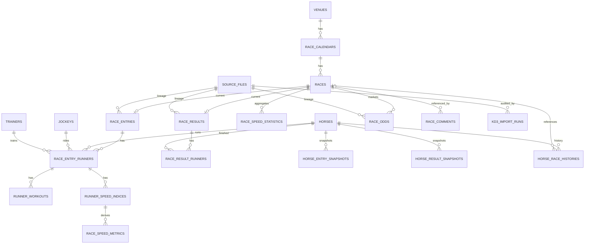

# KD3 Domain ER

```mermaid
erDiagram
    VENUES ||--o{ RACE_CALENDARS : has
    RACE_CALENDARS ||--o{ RACES : has
    RACES ||--o| RACE_ENTRIES : current
    RACE_ENTRIES ||--o{ RACE_ENTRY_RUNNERS : has
    HORSES ||--o{ RACE_ENTRY_RUNNERS : runs
    JOCKEYS ||--o{ RACE_ENTRY_RUNNERS : rides
    TRAINERS ||--o{ RACE_ENTRY_RUNNERS : trains
    RACE_ENTRY_RUNNERS ||--o{ RUNNER_WORKOUTS : has
    RACE_ENTRY_RUNNERS ||--o{ RUNNER_SPEED_INDICES : has
    RUNNER_SPEED_INDICES ||--o{ RACE_SPEED_METRICS : derives
    RACES ||--o{ RACE_SPEED_STATISTICS : aggregates
    RACES ||--o| RACE_RESULTS : current
    RACE_RESULTS ||--o{ RACE_RESULT_RUNNERS : has
    HORSES ||--o{ RACE_RESULT_RUNNERS : finished
    HORSES ||--o{ HORSE_ENTRY_SNAPSHOTS : snapshots
    HORSES ||--o{ HORSE_RESULT_SNAPSHOTS : snapshots
    HORSES ||--o{ HORSE_RACE_HISTORIES : history
    RACES o|--o{ HORSE_RACE_HISTORIES : references
    RACES ||--o{ RACE_ODDS : markets
    RACES o|--o{ RACE_COMMENTS : referenced_by
    SOURCE_FILES ||--o{ KD3_IMPORT_RUNS : audited_by
    SOURCE_FILES ||--o{ RACE_ENTRIES : lineage
    SOURCE_FILES ||--o{ RACE_RESULTS : lineage
    SOURCE_FILES ||--o{ RACE_ODDS : lineage
```

`source_identifiers.entity_id` は複数entity tableを指すgeneric mappingのため、既存設計どおり物理FKを持たない。その他の参照はMigrationでRESTRICT FKを持つ。
