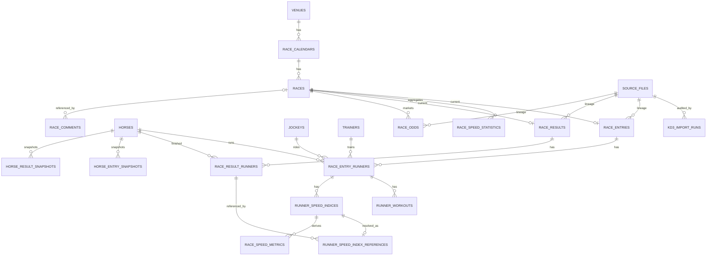

# KD3 Domain ER

`runner_speed_indices` は `kol_den2.kd3` が配布した値そのものを保持する source fact であり、参照レースを内包しない。
参照先は再計算可能な派生データとして `runner_speed_index_references` に分離する。未解決の場合は reference row を作成しない。

`kol_uma.kd3` の直近5走・6〜55走は canonical history として保存しない。過去走は `races` / `race_results` / `race_result_runners` から導出する。

`source_identifiers.entity_id` は複数entity tableを指すgeneric mappingのため、既存設計どおり物理FKを持たない。その他の参照はMigrationでRESTRICT FKを持つ。
